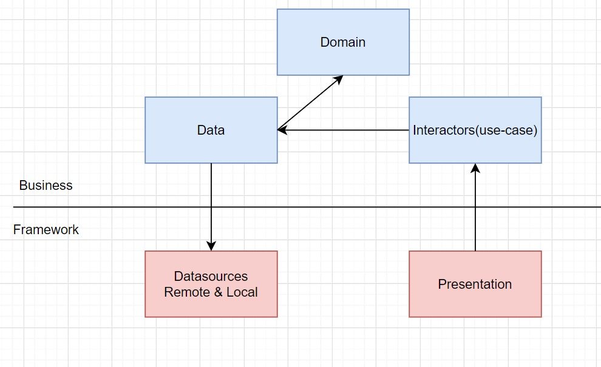
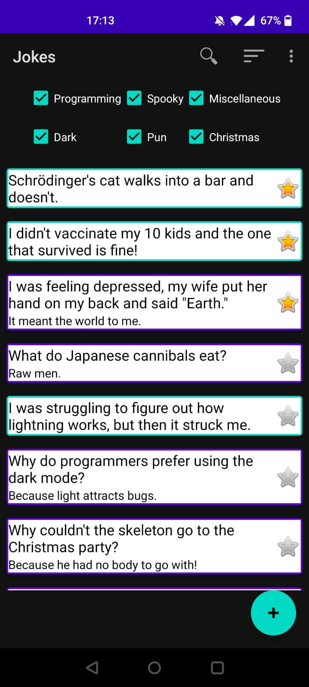
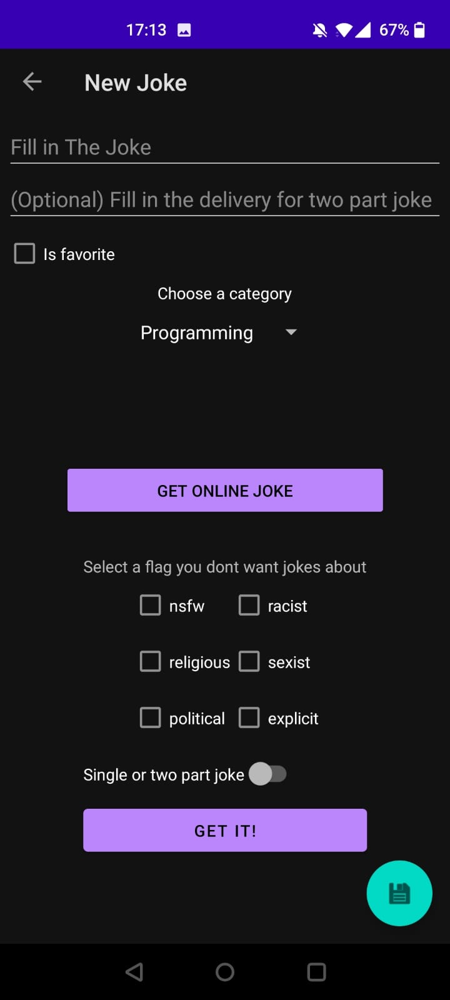
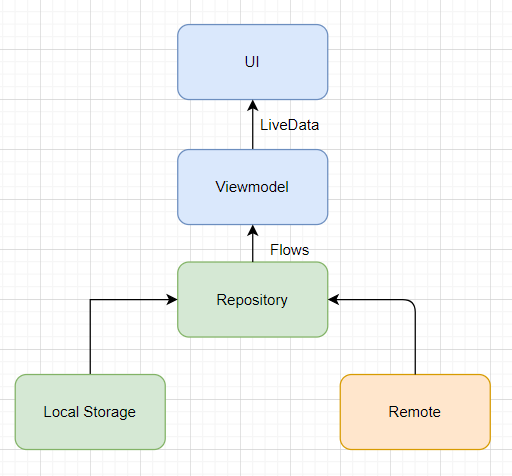

# About Joke application

This is an Android application to store, sort, rate and search Jokes. It also provides you with the possibility get jokes from an online database.

In this project I build an Android application using MVVM architecture. I used some Jetpack libraries, Kotlin Coroutines and Dagger Hilt. The app uses the [Joke API](https://jokeapi.dev/) as a remote data source.

# CLEAN architecture

I have decided to update the application to have a clean architecture following this structure

  

This is not done yet. The following needs to be done: 

* remove use-cases from viewmodel and place in seperate Interactors

# Screenshots

  
  

# The presentation layout
### Communication between layers
1. UI calls method from ViewModel.
2. Logic is handled in Viewmodels
3. Viewmodels send LiveData or Events back to UI
4. The Repository provides viewModel with data from local or remote sources 
5. The repository communicates with the Local storage with Flows. 

I made a diagram to show the flow of the data between the three layers.

Libraries Used
---------------
* [ViewModel](https://developer.android.com/topic/libraries/architecture/viewmodel) - designed to store and manage UI-related data in a lifecycle conscious way
* [ViewBinding](https://developer.android.com/topic/libraries/view-binding) - Offers a type safe way to access views. 
* [Navigation Components](https://developer.android.com/guide/navigation/navigation-getting-started) - offers a way to navigate between Fragments
* [Material](https://material.io/develop/android/docs/getting-started/) - Material Components.
* [DataStore](https://developer.android.com/topic/libraries/architecture/datastore) - Provides Local Key-value storage
* [Room database](https://developer.android.com/training/data-storage/room) Abstraction layer over local SQLite persistence
* [Coroutine](https://github.com/Kotlin/kotlinx.coroutines) - Provides a way to do background tasks
* [Flows](https://kotlin.github.io/kotlinx.coroutines/kotlinx-coroutines-core/kotlinx.coroutines.flow/-flow/) - To transfer data in stream asyncronous
* [Retrofit2](https://square.github.io/retrofit/)- HTTP client
* [Gson](https://github.com/google/gson) - JSON Parser
* [Dagger Hilt](https://dagger.dev/hilt/) - dependency injector

# To be added
* Unit testing for Business layer
* Instrumentation test for Framework layer

 
